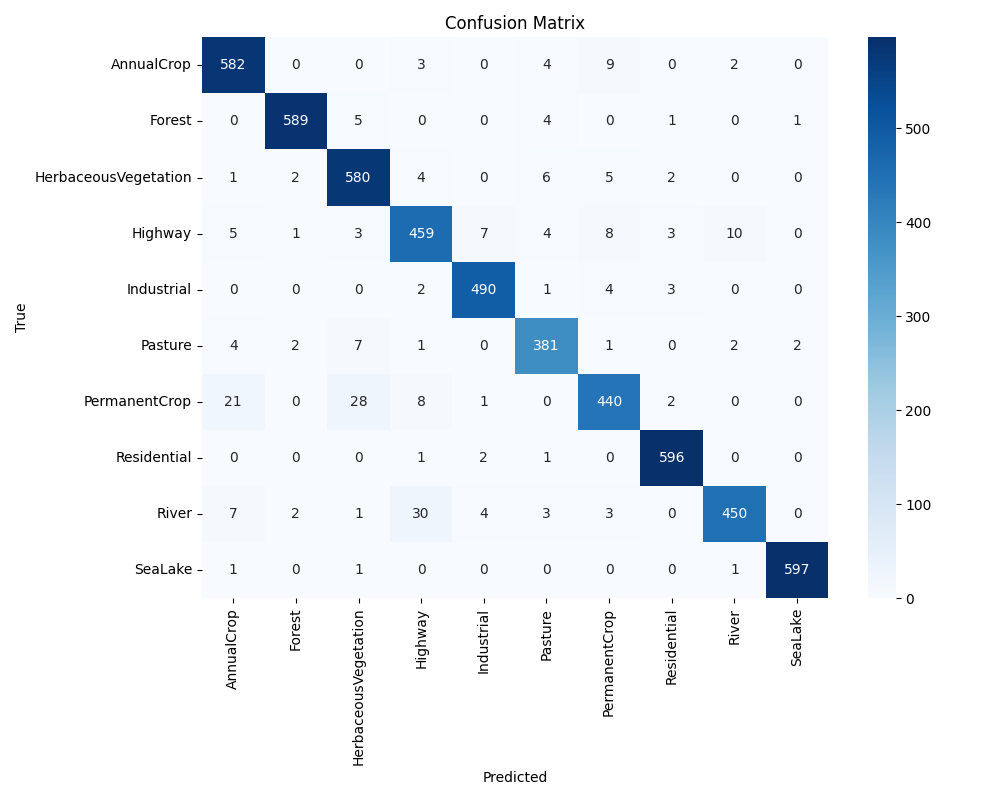
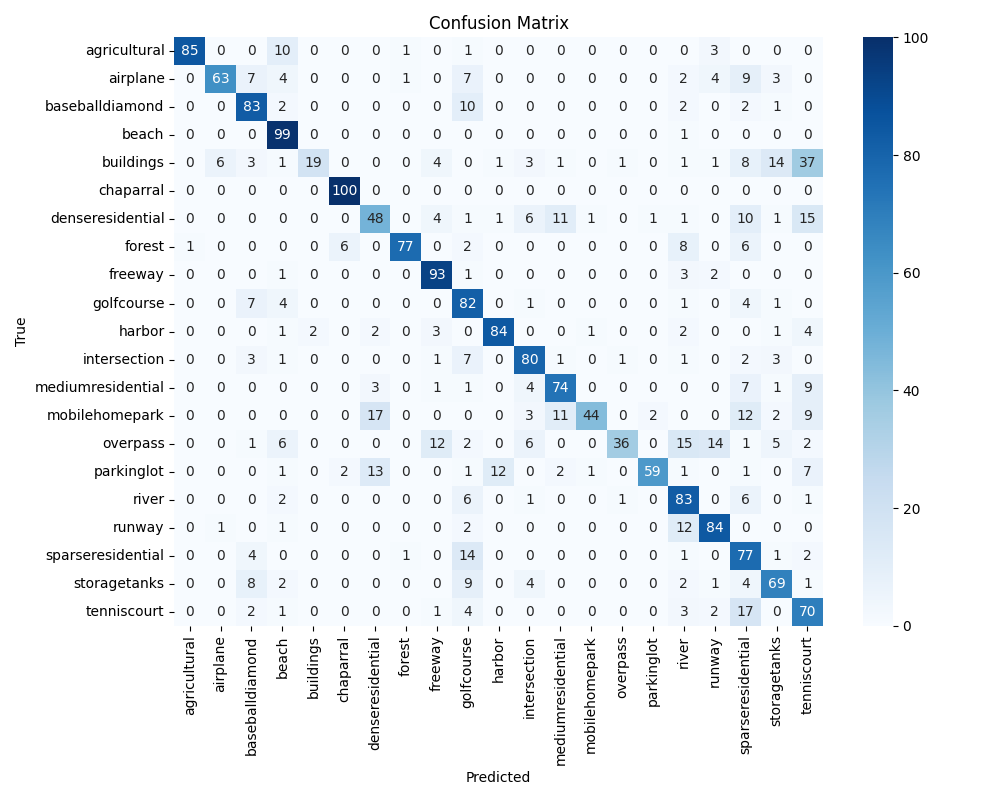
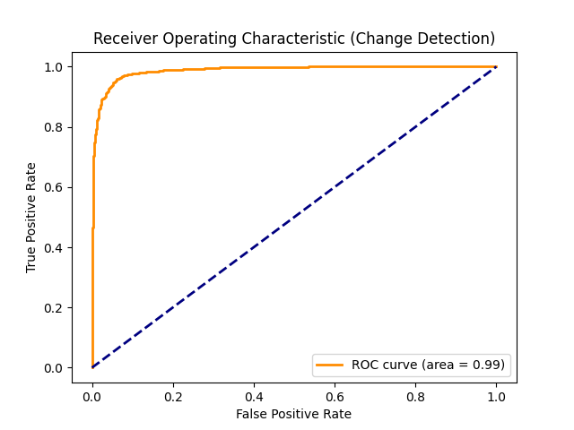
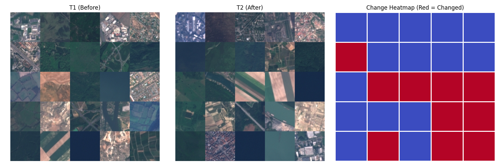

# Satellite Image Land-Use Classifier & Temporal Change Detector
**Final Project Report**

---

## 1. Introduction and Problem Statement
The monitoring of land-use and land-cover changes is critical for urban planning, deforestation tracking, and environmental conservation. Traditional manual analysis of satellite imagery is time-consuming and unscalable. This project aims to build an automated computer vision system capable of classifying land-use types from satellite imagery and detecting temporal changes between two time periods using deep learning embeddings. 

The primary objectives are:
1. To train a Convolutional Neural Network (CNN) that classifies land-use from satellite tiles.
2. To develop a temporal change detector utilizing embedding-based cosine similarity.
3. To deploy a functional geo-dashboard for interactive visualization.

## 2. Methodology

### 2.1 Datasets and Data Pipeline
The project utilizes two primary datasets:
- **EuroSAT:** 27,000 Sentinel-2 satellite images categorized into 10 land-use classes. This dataset was used for training and validation.
- **UC Merced Land Use:** 2,100 high-resolution images categorized into 21 classes, serving as the holdout test set to evaluate domain adaptation and feature extraction quality.

To prevent **spatial leakage**, a spatial block split strategy was employed. Instead of randomly splitting individual tiles (which often places highly correlated adjacent tiles into both training and validation sets), the dataset was partitioned into contiguous blocks before splitting, ensuring a robust evaluation of the model's generalization capabilities.

### 2.2 Land-Use Classifier (Transfer Learning)
A pre-trained **ResNet-18** architecture was chosen as the backbone due to its optimal balance between computational efficiency and accuracy. A two-phase fine-tuning strategy was implemented:
- **Phase 1:** The backbone was frozen, and only the final classification head was trained for 3 epochs.
- **Phase 2:** The last two convolutional blocks (`layer3` and `layer4`) were unfrozen, and the learning rate was reduced by a factor of 10 for an additional 5 epochs.

A baseline 3-layer CNN was also trained from scratch to serve as a performance floor for comparison.

### 2.3 Temporal Change Detector
The fine-tuned ResNet-18 model (with the classifier head removed) was repurposed as a feature extractor, generating 512-dimensional embeddings for each tile. To simulate a time series, geographic regions were partitioned into T1 (before) and T2 (after) splits. Pairwise cosine similarity was computed between the embeddings of T1 and T2 tiles. 

A Receiver Operating Characteristic (ROC) curve was plotted, and Youden's J statistic was utilized to determine the optimal similarity threshold for flagging land-cover changes.

## 3. Results and Evaluation

### 3.1 Classification Performance
The ResNet-18 model demonstrated exceptional performance on the EuroSAT validation set, achieving a **Macro F1-Score of 0.95**. The ablation study confirmed that the two-phase fine-tuning (unfreezing the deeper layers) significantly improved the model's ability to capture domain-specific remote sensing features compared to the frozen backbone approach.

When evaluated on the UC Merced holdout set using a linear probe, the feature extractor achieved a **Macro F1-Score of 0.71**. This is a strong result considering the severe domain shift (European 10m resolution vs. US 0.3m resolution) and class mismatch between the datasets.

*Please refer to the confusion matrices below:*

### 3.2 Change Detection Performance
The change detector successfully distinguished between static and altered regions. Based on the ROC curve analysis, an optimal cosine similarity threshold of **0.4410** was established. Tile pairs falling below this threshold are flagged as changed, while pairs above it are considered unchanged.

Visual inspection of the generated heatmaps confirms that the system accurately highlights structural and class-level changes in the simulated regions. Here is an example of a change heatmap:

### 3.3 Error Analysis
An analysis of the top-5 misclassified pairs on the UC Merced dataset (`Error_Analysis.ipynb`) revealed key failure modes:
1. **Scale and Resolution:** The model struggled to adapt its features (learned from 10m EuroSAT pixels) to high-resolution objects like storage tanks and buildings.
2. **Contextual Confusion:** Classes such as `freeway` and `overpass` share identical low-level features (asphalt, vehicles) and were frequently confused due to the lack of broader contextual receptive fields.
3. **Domain Shift:** European landscapes differ architecturally and agriculturally from US landscapes, causing misclassifications in residential and agricultural categories.

## 4. Limitations and Future Scope
While the prototype is highly functional, it has certain limitations:
1. **Static Dataset:** The current pipeline simulates temporal change using static datasets rather than chronological satellite passes.
2. **Resolution Sensitivity:** The embeddings are highly sensitive to the spatial resolution of the training data, leading to degraded performance on higher-resolution datasets.

**Future Enhancements:** 
For production deployment, this system can be integrated directly with live satellite APIs (such as the Copernicus Sentinel-2 API or Google Earth Engine). An automated pipeline could fetch multi-temporal images of a specific region, pass them through the ResNet-18 feature extractor, and trigger real-time alerts for illegal deforestation, rapid urbanization, or disaster impact assessment.

---
*Generated for the Computer Vision Project Submission.*
